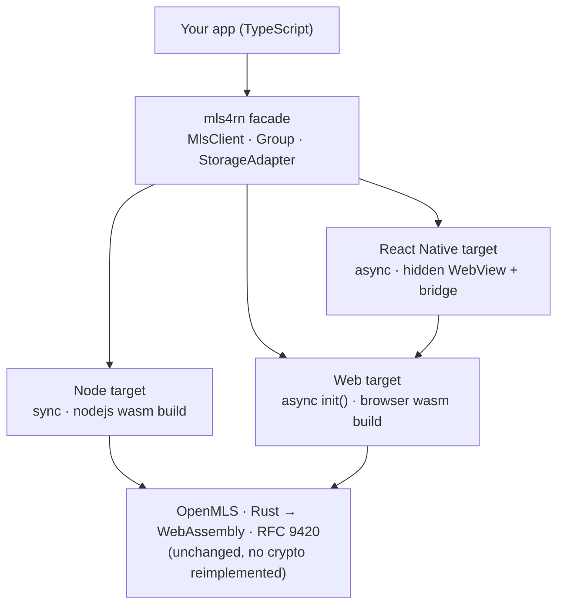

# MLS4RN — Presenter's Guide

A runbook for demoing MLS4RN to leads or teammates. It covers the one-line story, an architecture diagram, a live-demo script for **all three targets** (Node, Web, React Native), talking points, and a Q&A cheat sheet.

> **The one big idea:** we wrote *one* TypeScript wrapper over OpenMLS and it now runs end-to-end encrypted MLS group messaging in **Node.js, the browser, and React Native** — reusing the same audited Rust crypto, compiled to WebAssembly. No cryptography was reimplemented in JavaScript.

---

## Architecture at a glance



One facade, three runtimes. Node calls the WebAssembly synchronously; the browser loads it with an async `init()`; React Native (whose engine has no WebAssembly) runs the **web build inside a hidden WebView** and talks to it over a `postMessage` bridge. All three end at the same OpenMLS.

---

## The 90-second story (what to say first)

1. **The problem** — MLS (IETF RFC 9420) is the modern standard for end-to-end encrypted *group* messaging (forward secrecy, post-compromise security), but the reference implementation, OpenMLS, is Rust. App teams work in TypeScript.
2. **What we built** — a thin, typed TypeScript SDK (`MlsClient` / `Group`) over OpenMLS-compiled-to-WebAssembly. Same crypto, ergonomic JS API.
3. **Why it matters** — the *same* SDK now works across Node, web, and React Native, so one integration serves backends, web apps, and mobile.
4. **It's real** — every demo below drives the actual SDK and the actual OpenMLS crypto. Nothing is mocked or hard-coded.

---

## Live demo runbook

Pick based on time and setup. **The Node demos are the most reliable for a live audience** (one terminal, a couple of seconds, no simulator). Web and React Native show the same thing on real target platforms.

### Target 1 — Node.js (terminal) · most reliable

One-time setup from the repo root:

```bash
npm install
```

**Demo A — narrated encrypted group chat:**

```bash
npm run demo:present            # press Enter to advance each beat
# FAST=1 npm run demo:present   # autoplay, no pauses
# NO_COLOR=1 npm run demo:present
```

What to point at as it runs:
- The **ciphertext on the wire** — what a server would see.
- Every member **decrypts the same message** — it's a real group, not 1:1.
- The **restart** beat — the session is reloaded from disk and still works (persistence).
- Closing line: *"powered by OpenMLS compiled to WebAssembly — no crypto reimplemented."*

**Demo B — encrypted file sharing:**

```bash
npm run demo:files
```

The point: a per-file key is **derived from the MLS group** (`exportKey`), the file is encrypted, and only the **ciphertext** is uploaded to an untrusted "server." Any member re-derives the key and gets the byte-identical file back; the server can never open it.

**Demo C — quick smoke test (no narration):** `npm run demo` — three participants form a group, exchange messages, and confirm exported keys match across all members.

### Target 2 — Web (browser)

```bash
# repo root: build the SDK the browser demo consumes
npm install && npm run build

# then in examples/web
cd examples/web
npm install
npm run dev            # open the printed http://localhost URL
```

What to show: type a message as any member; it's encrypted with the group key and only members decrypt it. The **"on the wire" panel shows the actual ciphertext**. Emphasize: *nothing runs on a server — the entire group and all crypto run in the browser tab.*

### Target 3 — React Native (simulator / device)

```bash
# 1) repo root — build the web SDK the host embeds
npm install && npm run build

# 2) build the RN package (host bundle + type declarations)
cd packages/react-native && npm install && npm run build

# 3) run the example app
cd ../../examples/react-native && npm install && npm run ios   # or: npm run android
```

What to show: two clients (alice, bob) form a group on-device; type as alice, tap **Send**, watch bob decrypt, with the ciphertext shown on the wire. Then **reload the app** to show the session was restored from `AsyncStorage`. Emphasize: *the crypto runs on-device inside a hidden WebView — no server, real OpenMLS on a phone.*

> If Expo Go can't load the native `react-native-webview`, use a dev build: `npx expo run:ios` / `run:android`.

---

## Key talking points

- **It's the real thing.** Every demo drives the SDK facade and the real OpenMLS WebAssembly — not a mock or a recording.
- **No crypto reimplemented.** We wrap OpenMLS (the Rust reference implementation of RFC 9420); we don't write cryptography in JavaScript.
- **One SDK, three targets.** The same `MlsClient` / `Group` API works in Node, web, and React Native. Web and RN are async; Node is sync.
- **Modern security properties.** MLS gives efficient group key management with forward secrecy and post-compromise security — beyond simple pairwise encryption.
- **Server sees only ciphertext.** In every demo the "server" only ever holds encrypted bytes; keys never leave the members.
- **Prototype, contributor-ready.** The build is reproducible and documented; contributors don't need a Rust toolchain to *use* the SDK (the WebAssembly is committed).

---

## Q&A cheat sheet

**Is this production-ready?** No — it's a functional prototype. It proves the integration works end-to-end across all three targets. See Limitations.

**Did you implement any crypto?** No. All cryptography is OpenMLS (audited Rust, RFC 9420) compiled to WebAssembly. Our code is the typed facade and the transport/persistence glue.

**Why a WebView on React Native?** RN's JavaScript engine (Hermes) has no WebAssembly runtime. Rather than maintain a second native binding, we run the existing web build inside a hidden WebView and bridge to it — maximum reuse, same crypto. (Alternatives considered: native Rust bindings via uniffi, wasm2c/Polygen, wasm3 — heavier for a prototype.)

**Is the WebView slow?** Calls cross a `postMessage` bridge (bytes base64-encoded), which is fine for chat-scale messaging. It isn't tuned for high-throughput streaming.

**What happens if OpenMLS updates?** The wrapper depends on the generated WebAssembly bindings, not the Rust internals — routine updates are a rebuild, not a rewrite. API-breaking changes to the bindings would need facade updates.

**How is data persisted?** Via a `StorageAdapter` (a file adapter on Node, AsyncStorage on React Native). `save()` writes a full snapshot of the client's storage; without an adapter, clients are in-memory.

**Does anything touch a server?** No. Every demo runs entirely locally / on-device. A real app would ship the ciphertext and public key material through its own delivery service.

---

## Limitations (be upfront)

- **Prototype**, not hardened for production.
- **Single fixed ciphersuite** — `MLS_128_DHKEMX25519_CHACHA20POLY1305_SHA256_Ed25519`.
- **Async on web and React Native** (Node is sync); RN adds WebView bridge overhead.
- **Persistence is coarse** — full-snapshot on each `save()`, and snapshots hold private keys unencrypted at rest unless the adapter encrypts them.
- **Add-only membership** in the current facade (no remove/update flows yet).

---

## Where the code lives

| Piece | Path |
|-------|------|
| Core SDK (facade, storage, wasm glue) | `src/` |
| Node demos (chat, files, smoke) | `src/demo-chat.ts`, `src/demo-files.ts`, `src/demo.ts` |
| Web demo (React) | `examples/web/` |
| React Native package | `packages/react-native/` |
| React Native demo (Expo) | `examples/react-native/` |
| OpenMLS WebAssembly bindings (vendored, read-only) | `openmls/openmls-wasm/` |
